# Executive AI Operating System

## 1. Visão executiva

O **Executive AI Operating System** é uma plataforma operacional pessoal e corporativa para centralizar comunicação, agenda, projetos, conhecimento, decisões e automações de um executivo de tecnologia com múltiplos papéis: Tech Lead, Product Leader, Consultor Salesforce, Empreendedor e Gestor de Projetos.

O sistema atua como um **Chief of Staff Digital**: observa sinais de Outlook, Teams, Calendar, Jira e repositórios de conhecimento; consolida contexto; prioriza riscos; recomenda ações; registra decisões; e reduz a troca de contexto entre ferramentas.

## 2. Princípios de desenho

1. **Human-in-the-loop por padrão:** ações externas sensíveis, como enviar e-mail, alterar Jira ou cancelar reunião, devem exigir aprovação explícita.
2. **Explicabilidade:** toda recomendação deve registrar evidências, pesos, trade-offs e fonte dos dados.
3. **Fonte de verdade auditável:** PostgreSQL armazena metadados, estados, relatórios e trilha de auditoria; Qdrant armazena vetores para busca semântica.
4. **Separação entre ingestão, raciocínio e execução:** n8n coleta e orquestra; modelos OpenAI/Gemini analisam; conectores executam mudanças autorizadas.
5. **Segurança first:** OAuth, escopos mínimos, criptografia, logs sem segredos, retenção controlada e segregação por executivo/tenant.
6. **Operação incremental:** iniciar com briefing diário e atas; depois expandir para RAG, PMO, agente e dashboard.

## 3. Arquitetura global

### 3.1 Componentes

| Camada | Componentes | Responsabilidade |
| --- | --- | --- |
| Canais | Outlook, Teams, Calendar, Jira, iPhone Shortcuts, Dashboard Web | Entrada e saída de trabalho executivo. |
| Orquestração | n8n | Workflows, schedules, webhooks, retries, aprovações e integrações. |
| IA | OpenAI GPT, Google Gemini | Classificação, sumarização, extração, raciocínio, recomendações, RAG e geração de respostas. |
| Dados transacionais | PostgreSQL | Estado operacional, itens normalizados, relatórios, recomendações e auditoria. |
| Memória semântica | Qdrant | Embeddings e busca vetorial de e-mails, reuniões, chats, Jira e documentos. |
| Observabilidade | Prometheus, Grafana, Loki, Promtail | Métricas, logs, alertas e análise de falhas. |
| Infraestrutura | Docker, Docker Compose, Ubuntu Server | Deploy simples, reprodutível e expansível. |
| Frontend | Next.js, React, TypeScript, Tailwind, shadcn/ui | Dashboard executivo moderno. |

### 3.2 Diagrama de componentes

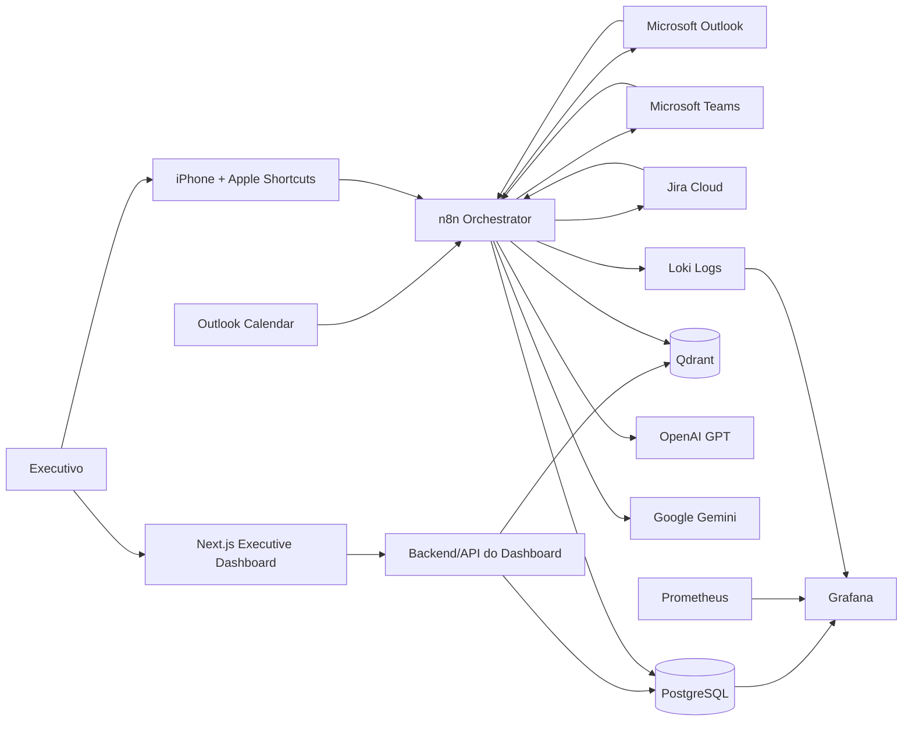

### 3.3 Fluxo técnico padrão

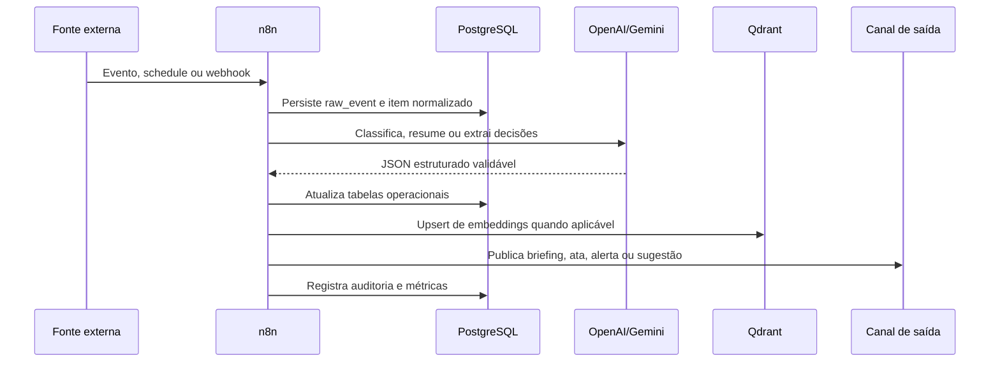

## 4. FASE 0 — Fundação

### 4.1 Objetivo

Implantar a base técnica para operar automações executivas com segurança, observabilidade, persistência e memória semântica. A fundação deve permitir expansão gradual das fases sem reescrever integrações centrais.

### 4.2 Arquitetura

A infraestrutura inicial usa Ubuntu Server com Docker Compose para executar n8n, PostgreSQL, Qdrant, Redis, Prometheus, Grafana, Loki e Promtail. O arquivo `docker-compose.yml` materializa essa stack base.

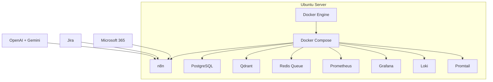

### 4.3 Docker Compose

O Compose define serviços para persistência relacional, vetorial, filas e observabilidade. Os segredos devem ser passados por variáveis de ambiente fora do Git, incluindo `POSTGRES_PASSWORD`, `N8N_ENCRYPTION_KEY` e `GRAFANA_ADMIN_PASSWORD`.

### 4.4 Estrutura de banco PostgreSQL

O schema base está organizado em domínios:

| Domínio | Tabelas principais | Uso |
| --- | --- | --- |
| Identidade e integrações | `executives`, `integration_accounts` | Cadastro do executivo, contas e referências de segredos. |
| Ingestão | `raw_events` | Registro idempotente de eventos externos. |
| Comunicação | `email_items`, `teams_messages` | Itens de Outlook e Teams classificados por IA. |
| Agenda | `calendar_events` | Reuniões, conflitos, preparação e links Teams. |
| Projetos | `jira_issues` | Tarefas, riscos, bloqueios e dependências. |
| Reuniões | `meetings`, `decisions` | Transcrições, atas, decisões e ações. |
| Execução | `daily_briefings`, `pmo_reports`, `agent_recommendations` | Briefings, reports e recomendações explicáveis. |
| RAG | `knowledge_documents`, `knowledge_chunks` | Documentos e chunks com ponte para Qdrant. |
| Governança | `audit_log` | Auditoria de ações e alterações. |

### 4.5 Estratégia de backup

1. **PostgreSQL:** `pg_dump` diário, retenção de 30 dias, cópia criptografada para storage externo e restore testado mensalmente.
2. **Qdrant:** snapshot diário por coleção, retenção de 14 dias e cópia para storage externo.
3. **n8n:** exportação versionada de workflows e credenciais referenciadas por secrets manager, sem exportar tokens em texto claro.
4. **Configuração:** versionar Compose, schema, prompts e documentação; não versionar `.env`.
5. **Teste de recuperação:** executar simulação trimestral de desastre em ambiente isolado.

### 4.6 Estratégia de monitoramento

| Métrica | Origem | Alerta recomendado |
| --- | --- | --- |
| Falhas de workflow n8n | n8n logs + PostgreSQL | Mais de 3 falhas por workflow em 30 minutos. |
| Latência de IA | n8n execution data | p95 acima de 20 segundos. |
| Custo diário de tokens | logs de chamadas IA | Acima de orçamento diário definido. |
| Uso de disco PostgreSQL/Qdrant | Prometheus | Acima de 80%. |
| Tempo desde último sync | tabelas `integration_accounts` | Mais de 2 horas sem sync em horário comercial. |

### 4.7 Estratégia de logs

Logs devem ir para Loki com correlação por `workflow_id`, `execution_id`, `executive_id`, `source_system` e `correlation_id`. Não registrar tokens OAuth, conteúdo completo de e-mails sensíveis ou transcrições integrais em logs de aplicação; armazenar payloads sensíveis apenas em tabelas com retenção e controle de acesso.

### 4.8 Estratégia de segurança

1. OAuth Microsoft Graph com escopos mínimos para Mail, Calendar e Teams.
2. Jira API token armazenado como credencial n8n criptografada.
3. Criptografia em repouso no volume do servidor e TLS no reverse proxy.
4. MFA obrigatório para contas administrativas.
5. Segregação por `executive_id` em todas as tabelas.
6. Aprovação humana para envio de respostas, replanejamento de agenda e alterações em Jira.
7. Logs de auditoria para toda ação automatizada.
8. Política de retenção: 90 dias para eventos brutos, 2 anos para decisões, parametrizável para e-mails e transcrições.

### 4.9 Gestão de credenciais

Credenciais devem ficar em n8n Credentials, Docker secrets ou cofre externo. O PostgreSQL deve armazenar apenas `token_secret_ref`, nunca tokens. Renovação de chaves deve ocorrer a cada 90 dias ou imediatamente após mudança de equipe/fornecedor.

### 4.10 Gestão de custos

| Item | Driver de custo | Otimização |
| --- | --- | --- |
| OpenAI/Gemini | tokens de entrada/saída e embeddings | Resumos incrementais, cache, prompts compactos e uso de modelos menores para classificação. |
| Infra | VM, disco, backup | Retenção por política, compressão e snapshots incrementais. |
| Microsoft/Jira | licenças existentes | Reusar licenciamento corporativo. |
| Operação | manutenção | Runbooks, alertas e workflows idempotentes. |

### 4.11 Roadmap da fundação

| Semana | Entrega |
| --- | --- |
| 1 | VM Ubuntu, Docker, Compose, TLS, PostgreSQL e n8n. |
| 2 | Microsoft Graph, Jira, secrets e schema inicial. |
| 3 | Qdrant, embeddings, observabilidade e backups. |
| 4 | Hardening, alertas, restore test e documentação operacional. |

### 4.12 Riscos

| Risco | Mitigação |
| --- | --- |
| Vazamento de dados executivos | Escopos mínimos, criptografia, retenção e auditoria. |
| Custo de IA imprevisível | Orçamento diário, limites por workflow e cache. |
| Falhas em APIs externas | Retries exponenciais, DLQ lógica e alertas. |
| Dependência excessiva da IA | Aprovação humana e explicabilidade. |

### 4.13 ROI esperado

A fundação viabiliza automações que devem economizar de 5 a 10 horas semanais em consolidação manual, preparação de reuniões, acompanhamento de pendências e busca por contexto.

### 4.14 Critérios de aceite

- Docker Compose sobe todos os serviços essenciais.
- PostgreSQL inicializa com schema sem erro.
- n8n conecta em PostgreSQL e Redis.
- Qdrant responde a health check.
- Backups de PostgreSQL e Qdrant são executados e restaurados em teste.
- Logs e métricas aparecem no Grafana.

## 5. FASE 1 — Executive Daily Briefing

### 5.1 Objetivo

Gerar diariamente um briefing executivo com e-mails não lidos, e-mails prioritários, aguardando resposta, agenda, conflitos, horários livres, menções do Teams, mensagens importantes, tarefas Jira abertas, críticas e vencidas.

### 5.2 Arquitetura

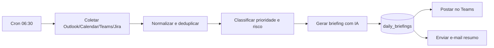

### 5.3 Fluxos n8n

#### Workflow F1.1 — Daily Data Collection

1. **Cron Node:** 06:30 no timezone do executivo.
2. **Microsoft Outlook Node:** buscar e-mails não lidos das últimas 72 horas, e-mails marcados como importante e conversas com último e-mail enviado pelo executivo há mais de 48 horas sem resposta.
3. **Microsoft Calendar Node:** buscar eventos do dia e do próximo dia útil.
4. **Microsoft Teams Node/Graph HTTP:** buscar menções, replies diretas e mensagens salvas/importantes.
5. **Jira Node:** buscar issues atribuídas ao executivo, lideradas por ele, vencidas, bloqueadas ou com prioridade alta.
6. **Function Node:** normalizar campos, gerar hash de conteúdo e gravar em `raw_events`.
7. **PostgreSQL Node:** upsert em tabelas de domínio.

#### Workflow F1.2 — AI Briefing Generation

1. **PostgreSQL Node:** carregar dados consolidados do dia.
2. **Code Node:** calcular conflitos, janelas livres e contagem por fonte.
3. **OpenAI GPT Node:** produzir JSON com resumo, prioridades, riscos e recomendações.
4. **Gemini Node opcional:** revisão crítica do briefing, buscando lacunas e riscos omitidos.
5. **PostgreSQL Node:** upsert em `daily_briefings`.
6. **Teams Node:** publicar em canal privado ou chat consigo mesmo.
7. **Outlook Node:** enviar e-mail com versão executiva.

### 5.4 Estrutura de dados

Usa `email_items`, `calendar_events`, `teams_messages`, `jira_issues` e `daily_briefings`. O briefing deve armazenar `source_counts` para explicar a cobertura de dados e permitir auditoria.

### 5.5 Integrações

- Microsoft Graph: `/me/messages`, `/me/events`, Teams chats/channels.
- Jira JQL: `assignee = currentUser() OR project in (...) ORDER BY priority DESC, due ASC`.
- OpenAI/Gemini: geração estruturada em JSON.
- Teams/Outlook: entrega do briefing.

### 5.6 Prompt de IA

```text
Você é meu Chief of Staff Digital. Gere um briefing executivo diário em português.
Entrada: e-mails, agenda, Teams e Jira em JSON.
Saída obrigatória em JSON com: executive_summary, top_priorities[], risks[], recommendations[], agenda_notes[], waiting_for[], decisions_needed[].
Regras: seja objetivo; destaque impactos no negócio; cite evidências por source_id; nunca invente dados; marque incertezas; recomende no máximo 5 ações.
```

### 5.7 Segurança

O briefing pode conter dados sensíveis; deve ser publicado apenas em chat privado do executivo ou canal restrito. Links devem apontar para sistemas originais e respeitar permissões Microsoft/Jira.

### 5.8 Custos estimados

Baixo a médio: uma execução diária com prompt consolidado. Reduzir custo por pré-filtragem, sumarização incremental e limites de itens por fonte.

### 5.9 Roadmap

1. MVP com Outlook e Calendar.
2. Adicionar Jira e Teams.
3. Adicionar detecção de conflitos e horários livres.
4. Adicionar score histórico de prioridade por pessoa/projeto.

### 5.10 Riscos

- Falso positivo em prioridade: mitigar com feedback do executivo.
- Briefing longo demais: limitar a 5 prioridades e anexar detalhes sob demanda.
- Perda de itens por falha de API: registrar `last_sync_at` e alertar.

### 5.11 ROI esperado

Economia diária de 20 a 40 minutos e melhora na preparação para decisões críticas no início do dia.

### 5.12 Critérios de aceite

- Briefing entregue antes do início da agenda.
- Inclui no mínimo Outlook, Calendar e Jira no MVP.
- Identifica conflitos de agenda e itens vencidos.
- Cada recomendação possui evidências rastreáveis.

## 6. FASE 2 — Meeting Copilot

### 6.1 Objetivo

Capturar reuniões, processar transcrições, gerar atas, decisões, responsáveis, próximos passos e riscos, publicando automaticamente no Teams.

### 6.2 Arquitetura

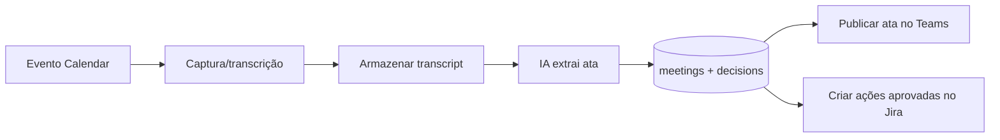

### 6.3 Fluxos n8n

#### Workflow F2.1 — Meeting Intake

1. Detectar reuniões com link Teams no calendário.
2. Registrar evento em `calendar_events`.
3. Associar transcrição exportada do Teams ou arquivo enviado por webhook.
4. Armazenar URI do arquivo e texto extraído em `meetings`.

#### Workflow F2.2 — Minutes Generation

1. Buscar transcrição nova.
2. Dividir transcrição em blocos se exceder limite de tokens.
3. Gerar resumo por bloco.
4. Consolidar ata final com decisões, responsáveis, próximos passos e riscos.
5. Inserir decisões em `decisions`.
6. Publicar mensagem no Teams.

### 6.4 Estrutura de dados

`meetings` armazena transcrição, resumo, decisões, ações e riscos. `decisions` cria registros pesquisáveis por RAG com aprovador, racional e data.

### 6.5 Integrações

- Outlook Calendar para metadados.
- Teams para transcrição e publicação.
- OpenAI/Gemini para sumarização e extração.
- Jira para criação opcional de tarefas aprovadas.

### 6.6 Prompt de IA

```text
Analise a transcrição de reunião. Extraia: resumo executivo, decisões, responsáveis, prazos, riscos, dependências, perguntas abertas e itens para Jira.
Para cada decisão, indique evidência textual curta, participante associado e nível de confiança.
Não invente responsáveis ou datas; quando ausente, use null e sinalize lacuna.
Retorne JSON válido.
```

### 6.7 Segurança

Transcrições devem ter retenção controlada. Publicação no Teams deve ocorrer apenas no canal correto da reunião/projeto. Decisões sensíveis devem permitir marcação como confidenciais.

### 6.8 Custos estimados

Médio, proporcional ao volume de reuniões e tamanho das transcrições. Otimizar com chunking, resumos incrementais e modelo menor para extração inicial.

### 6.9 Roadmap

1. Ingestão manual de transcrições.
2. Ingestão automática de transcrições Teams.
3. Publicação automática de atas.
4. Criação de tarefas Jira com aprovação.

### 6.10 Riscos

- Transcrição imprecisa: adicionar revisão humana.
- Ata publicada em local errado: validar mapping reunião-projeto-canal.
- Excesso de tarefas geradas: exigir aprovação.

### 6.11 ROI esperado

Economia de 30 a 60 minutos por reunião relevante e preservação consistente de decisões.

### 6.12 Critérios de aceite

- Ata gerada com decisões, ações, riscos e próximos passos.
- Publicação no Teams ocorre em até 15 minutos após transcrição disponível.
- Decisões ficam pesquisáveis no banco e no RAG.

## 7. FASE 3 — Inbox Intelligence

### 7.1 Objetivo

Classificar e-mails do Outlook como crítico, importante, delegável ou informativo, sugerir respostas, acompanhar follow-ups, gerar resumo diário e detectar pendências.

### 7.2 Arquitetura

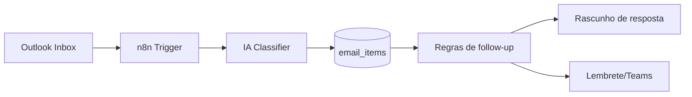

### 7.3 Fluxos n8n

- **F3.1 New Email Classifier:** trigger em novo e-mail, extrai metadados, classifica prioridade, detecta necessidade de resposta e grava `email_items`.
- **F3.2 Draft Reply Generator:** para e-mails críticos/importantes, gera rascunho no Outlook, não envia automaticamente.
- **F3.3 Follow-up Watcher:** diariamente identifica e-mails enviados aguardando resposta e cria lembrete.
- **F3.4 Inbox Daily Digest:** consolida pendências para o briefing.

### 7.4 Estrutura de dados

`email_items` guarda prioridade, categoria, `requires_response`, `waiting_on`, `suggested_reply`, `follow_up_at` e resumo.

### 7.5 Integrações

Outlook Mail, Teams para alertas, OpenAI/Gemini para classificação e geração, PostgreSQL para estado.

### 7.6 Prompt de IA

```text
Classifique o e-mail para um executivo de tecnologia.
Categorias: critico, importante, delegavel, informativo.
Avalie impacto, urgência, remetente, projeto, prazo e necessidade de resposta.
Retorne JSON: category, priority, requires_response, suggested_reply, delegation_candidate, follow_up_date, rationale, confidence.
```

### 7.7 Segurança

Não enviar respostas sem aprovação. Mascarar dados pessoais em logs. Restringir rascunhos automáticos a caixas autorizadas.

### 7.8 Custos estimados

Médio se aplicado a todos os e-mails. Recomenda-se pré-filtro por remetente, domínio, importância e thread ativa.

### 7.9 Roadmap

1. Classificação e tags.
2. Rascunhos para respostas.
3. Follow-up automático.
4. Aprendizado com feedback do executivo.

### 7.10 Riscos

- Classificação errada de e-mail crítico.
- Rascunho com tom inadequado.
- Automação gerar ruído.

### 7.11 ROI esperado

Redução de 30% a 50% do tempo de triagem de inbox.

### 7.12 Critérios de aceite

- 90% dos e-mails importantes classificados corretamente em amostra validada.
- Rascunhos exigem aprovação.
- Pendências aparecem no briefing diário.

## 8. FASE 4 — Jira Intelligence

### 8.1 Objetivo

Criar análise inteligente de Jira com Sprint Health, risco de atraso, bloqueios, dependências, gargalos, sobrecarga de pessoas e tendências. A IA atua como Scrum Master virtual.

### 8.2 Arquitetura

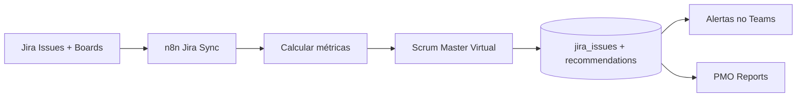

### 8.3 Fluxos n8n

- **F4.1 Jira Sync:** sincroniza issues, sprints, status, assignees, bloqueios e dependências.
- **F4.2 Sprint Health Analyzer:** calcula burndown, aging, throughput, bloqueios e risco.
- **F4.3 Blocker Escalation:** alerta bloqueios críticos acima de SLA.
- **F4.4 Workload Monitor:** detecta sobrecarga por assignee e recomenda redistribuição.

### 8.4 Estrutura de dados

`jira_issues` armazena status, prioridade, sprint, pontos, bloqueios, dependências e `risk_score`. Recomendações entram em `agent_recommendations`.

### 8.5 Integrações

Jira REST/JQL, Teams, PostgreSQL e IA.

### 8.6 Prompt de IA

```text
Atue como Scrum Master virtual. Analise issues, sprint, bloqueios, dependências e capacidade.
Gere riscos de atraso, gargalos, recomendações de mitigação e perguntas para o time.
Explique cada recomendação com evidências: issue_key, assignee, status, due_date e histórico.
Retorne JSON válido.
```

### 8.7 Segurança

Limitar permissões Jira a leitura no início. Escrita em Jira apenas para comentários/tarefas aprovadas.

### 8.8 Custos estimados

Baixo a médio, pois dados Jira são estruturados e menores que transcrições.

### 8.9 Roadmap

1. Métricas básicas de sprint.
2. Risco por issue.
3. Alertas proativos.
4. Tendências multi-sprint.

### 8.10 Riscos

- Métricas induzirem microgestão.
- Dados Jira desatualizados gerarem conclusões erradas.
- Assignees sem capacidade real registrada.

### 8.11 ROI esperado

Redução de atrasos por detecção precoce e menor tempo de preparação para rituais ágeis.

### 8.12 Critérios de aceite

- Dashboard de sprint mostra saúde, bloqueios e risco.
- Alertas incluem evidências e ações recomendadas.
- Recomendações são revisáveis pelo executivo.

## 9. FASE 5 — PMO Executivo

### 9.1 Objetivo

Gerar status diário, semanal, mensal e trimestral consolidando projetos, Jira, Teams, Outlook e calendário.

### 9.2 Arquitetura

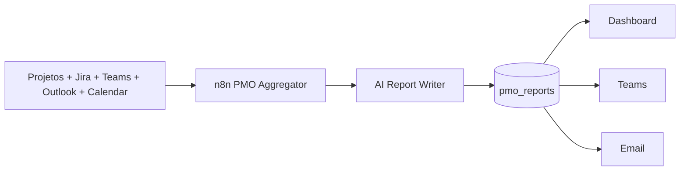

### 9.3 Fluxos n8n

- **F5.1 Daily Status:** progresso, riscos, decisões necessárias e próximos marcos.
- **F5.2 Weekly Executive Report:** evolução por projeto, variação de risco, marcos e impedimentos.
- **F5.3 Monthly Business Review:** entregas, valor gerado, capacidade, qualidade e roadmap.
- **F5.4 Quarterly Portfolio Review:** tendências, prioridades estratégicas, investimentos e trade-offs.

### 9.4 Estrutura de dados

`pmo_reports` armazena período, métricas, riscos e decisões necessárias. Dados derivam de Jira, reuniões, decisões e comunicações classificadas.

### 9.5 Integrações

Jira, Teams, Outlook, Calendar, PostgreSQL, dashboard e IA.

### 9.6 Prompt de IA

```text
Gere relatório PMO executivo para o período informado.
Estruture em: visão geral, progresso por iniciativa, principais riscos, decisões necessárias, dependências, próximos marcos, recomendações.
Use linguagem executiva, objetiva e orientada a impacto.
Inclua evidências por fonte e destaque incertezas.
```

### 9.7 Segurança

Relatórios podem consolidar informações confidenciais de múltiplos projetos. Aplicar classificação por público: pessoal, liderança, cliente, conselho.

### 9.8 Custos estimados

Médio para relatórios longos. Usar agregações pré-computadas e sumarização hierárquica.

### 9.9 Roadmap

1. Status diário automático.
2. Relatório semanal por projeto.
3. Relatório mensal executivo.
4. Quarterly review com tendências.

### 9.10 Riscos

- Relatórios genéricos demais.
- Falta de dados estruturados de projetos fora do Jira.
- Exposição indevida a stakeholders.

### 9.11 ROI esperado

Redução de 2 a 4 horas semanais em preparação de status e melhora na qualidade de governança.

### 9.12 Critérios de aceite

- Relatórios gerados no prazo.
- Métricas e riscos têm fonte rastreável.
- É possível gerar versão por público-alvo.

## 10. FASE 6 — Chief of Staff Digital

### 10.1 Objetivo

Criar agente executivo capaz de priorizar agenda, recomendar ações, identificar riscos, detectar gargalos, sugerir delegações e replanejamento com explicabilidade.

### 10.2 Arquitetura

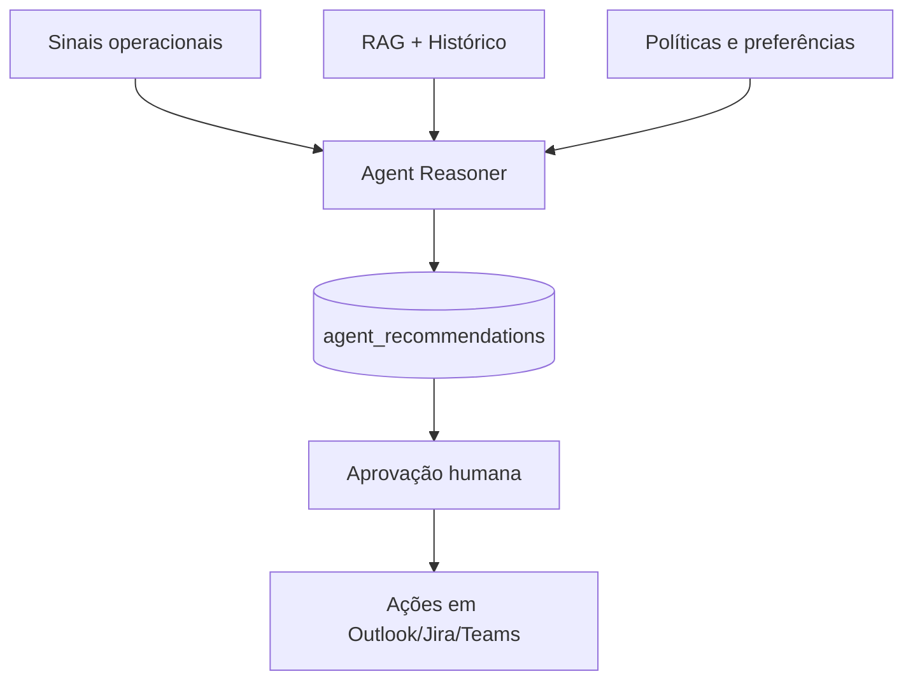

### 10.3 Fluxos n8n

- **F6.1 Executive Signal Scan:** roda a cada 2 horas em horário comercial, buscando novos riscos e pendências.
- **F6.2 Recommendation Generator:** cruza urgência, impacto, energia cognitiva, prazos e dependências.
- **F6.3 Approval Router:** envia cartões Adaptive Cards no Teams para aceitar, rejeitar ou adiar recomendações.
- **F6.4 Action Executor:** executa ações aprovadas, como criar tarefa, responder e-mail ou sugerir remarcação.

### 10.4 Estrutura de dados

`agent_recommendations` guarda tipo, título, recomendação, evidências, explicação, impacto, urgência e status.

### 10.5 Integrações

Todas as fontes operacionais, Teams para aprovação e canais de execução Microsoft/Jira.

### 10.6 Prompt de IA

```text
Você é um Chief of Staff Digital. Recomende ações para maximizar foco, reduzir risco e preservar compromissos.
Considere agenda, e-mails, Teams, Jira, decisões e preferências do executivo.
Para cada recomendação, explique: por que agora, evidências, impacto esperado, risco de não agir, esforço, alternativa e ação sugerida.
Nunca execute ações; apenas proponha JSON para aprovação.
```

### 10.7 Segurança

Separar recomendação de execução. Todas as ações externas devem ter trilha de auditoria e aprovação humana configurável por tipo.

### 10.8 Custos estimados

Médio, pois envolve raciocínio multi-fonte frequente. Aplicar limitação por horário, cache de sinais e ranking antes da IA.

### 10.9 Roadmap

1. Recomendações passivas.
2. Aprovação no Teams.
3. Execução de ações simples.
4. Aprendizado de preferências.

### 10.10 Riscos

- Recomendações excessivas gerarem fadiga.
- Agente sugerir ações politicamente inadequadas.
- Dependência do executivo em recomendações sem validação.

### 10.11 ROI esperado

Melhor alocação de tempo, redução de riscos esquecidos e mais decisões proativas.

### 10.12 Critérios de aceite

- Toda recomendação tem explicação e evidências.
- O executivo consegue aceitar/rejeitar em Teams.
- Ações aprovadas são auditadas.

## 11. FASE 7 — Memória Corporativa

### 11.1 Objetivo

Criar sistema RAG para indexar e-mails, reuniões, atas, Teams, Jira e documentos, permitindo perguntas como: o que foi decidido, quem aprovou, quando foi definido e qual contexto levou à decisão.

### 11.2 Arquitetura de embeddings

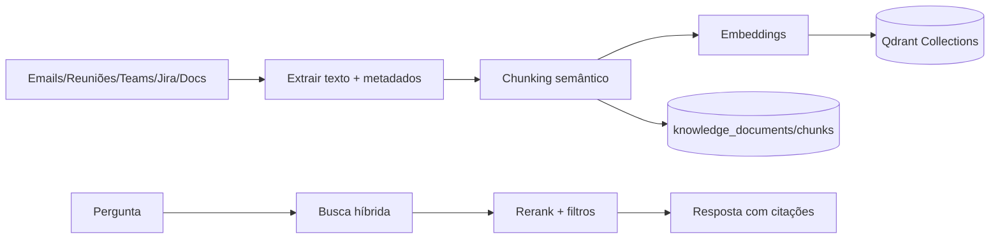

### 11.3 Coleções Qdrant

| Coleção | Conteúdo | Metadados |
| --- | --- | --- |
| `executive_emails` | chunks de e-mails relevantes | remetente, thread, data, projeto, confidencialidade. |
| `executive_meetings` | atas e transcrições | reunião, participantes, decisões, data. |
| `executive_teams` | mensagens importantes | canal, autor, data, menção. |
| `executive_jira` | issues e comentários | issue_key, projeto, sprint, status. |
| `executive_documents` | documentos anexos | tipo, dono, versão, projeto. |

### 11.4 Fluxos n8n

- **F7.1 Knowledge Ingestion:** identifica itens novos ou alterados.
- **F7.2 Chunk and Embed:** normaliza texto, cria chunks de 500 a 1.000 tokens, gera embeddings e upsert no Qdrant.
- **F7.3 RAG Question Answering:** recebe pergunta via dashboard, Teams ou iPhone; busca no Qdrant; monta contexto; responde com fontes.
- **F7.4 Decision Trace:** busca decisões e contexto anterior/posterior.

### 11.5 Estrutura de dados

`knowledge_documents` representa cada artefato. `knowledge_chunks` referencia chunks e `qdrant_point_id`. `decisions` permite respostas determinísticas para perguntas decisórias.

### 11.6 Integrações

OpenAI embeddings, Qdrant, PostgreSQL, Microsoft Graph, Jira e dashboard.

### 11.7 Prompt de IA

```text
Responda usando apenas o contexto recuperado.
Se a resposta não estiver no contexto, diga que não encontrou evidência suficiente.
Inclua: resposta curta, evidências, datas, pessoas, decisões relacionadas e grau de confiança.
Não exponha conteúdo marcado como confidencial fora do público permitido.
```

### 11.8 Segurança

Aplicar filtros por `executive_id`, confidencialidade, projeto e público. RAG deve herdar permissões dos sistemas fonte sempre que possível.

### 11.9 Custos estimados

Médio no backfill inicial; baixo incrementalmente. Embeddings são o principal custo inicial.

### 11.10 Roadmap

1. Indexar atas e decisões.
2. Indexar Jira e Teams importantes.
3. Indexar e-mails classificados.
4. Busca híbrida e reranking.

### 11.11 Riscos

- Recuperar contexto irrelevante.
- Responder sem evidência suficiente.
- Indexar dados além da retenção permitida.

### 11.12 ROI esperado

Redução drástica do tempo de busca por contexto e preservação de memória organizacional.

### 11.13 Critérios de aceite

- Perguntas sobre decisões retornam data, aprovador e evidências.
- Respostas sem evidência são recusadas.
- Filtros de permissão funcionam por fonte e projeto.

## 12. FASE 8 — Voice Executive Assistant

### 12.1 Objetivo

Criar assistente por voz para iPhone via Apple Shortcuts, permitindo comandos como “Crie uma tarefa”, “Me prepare para a próxima reunião” e “Quais são minhas prioridades?”.

### 12.2 Arquitetura

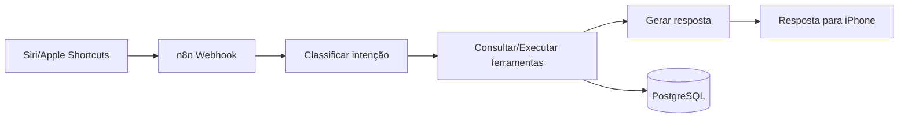

### 12.3 Atalhos Apple

| Atalho | Entrada | Ação |
| --- | --- | --- |
| Criar tarefa | Voz livre | POST para webhook n8n com texto, contexto e timestamp. |
| Preparar reunião | Voz ou próximo evento | Busca próximo evento, RAG e Jira; retorna briefing. |
| Minhas prioridades | Sem entrada | Retorna top prioridades do briefing e recomendações. |
| Registrar decisão | Voz livre | Cria decisão pendente para revisão. |

### 12.4 Fluxos n8n

- **F8.1 Voice Intent Router:** recebe webhook, autentica token, classifica intenção.
- **F8.2 Create Task:** extrai título, descrição, projeto, prazo e cria proposta de tarefa Jira.
- **F8.3 Meeting Prep:** busca próximo evento, participantes, histórico, decisões e pendências.
- **F8.4 Priority Readout:** sumariza prioridades em resposta curta para voz.

### 12.5 Estrutura de dados

Comandos entram em `raw_events` com source `shortcut`. Tarefas propostas viram `agent_recommendations` até aprovação.

### 12.6 Integrações

Apple Shortcuts, n8n webhook, PostgreSQL, Qdrant, Jira, Calendar e IA.

### 12.7 Prompt de IA

```text
Classifique o comando de voz do executivo.
Intenções: create_task, prepare_meeting, list_priorities, record_decision, unknown.
Extraia campos estruturados e gere resposta curta para áudio.
Se faltar informação crítica, faça uma pergunta objetiva.
```

### 12.8 Segurança

Webhook com token rotativo, allowlist de dispositivo quando possível, rate limit e ações sensíveis somente como proposta.

### 12.9 Custos estimados

Baixo, pois comandos são curtos. Meeting prep pode ter custo maior por RAG.

### 12.10 Roadmap

1. Listar prioridades.
2. Preparar reunião.
3. Criar tarefa proposta.
4. Registrar decisão por voz.

### 12.11 Riscos

- Erro de transcrição de voz.
- Execução acidental.
- Exposição em ambiente público.

### 12.12 ROI esperado

Captura rápida de tarefas e decisões, reduzindo perda de ideias e pendências durante deslocamentos.

### 12.13 Critérios de aceite

- Atalho responde em menos de 10 segundos para prioridades.
- Preparação de reunião traz contexto e riscos.
- Nenhuma ação externa sensível ocorre sem aprovação.

## 13. FASE 9 — Dashboard Executivo

### 13.1 Objetivo

Projetar aplicação web moderna com Next.js, React, TypeScript, Tailwind e shadcn/ui para centralizar agenda, Jira, Outlook, Teams, PMO, IA e memória corporativa.

### 13.2 Arquitetura frontend

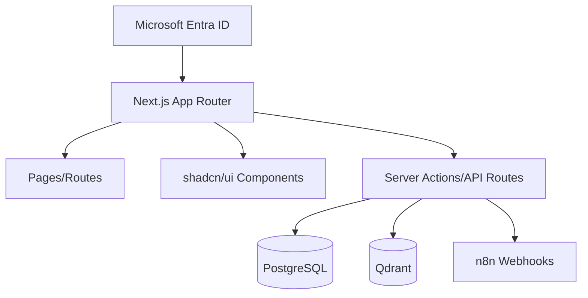

### 13.3 Módulos

| Módulo | Componentes | Objetivo |
| --- | --- | --- |
| Agenda | `AgendaTimeline`, `ConflictCard`, `FreeSlotsPanel` | Visualizar dia, conflitos e preparação. |
| Jira | `SprintHealth`, `RiskTable`, `BlockerBoard` | Acompanhar sprint e riscos. |
| Outlook | `InboxPriorityQueue`, `FollowUpList` | Priorizar e-mails e pendências. |
| Teams | `MentionFeed`, `DecisionFeed` | Ver menções e decisões recentes. |
| PMO | `ExecutiveReport`, `PortfolioHealth` | Status por período e projeto. |
| IA | `RecommendationCenter`, `ApprovalCard` | Aprovar ações do Chief of Staff. |
| Memória | `RagSearch`, `DecisionTrace` | Perguntar e rastrear contexto. |

### 13.4 Wireframes textuais

#### Home executiva

```text
+--------------------------------------------------------------------------------+
| Executive AI OS                                 [Search memory...] [Profile]    |
+----------------------+---------------------------+-----------------------------+
| Today's Priorities   | Agenda                    | AI Recommendations          |
| 1. ...               | 09:00 Meeting A           | [Approve] [Snooze]          |
| 2. ...               | 10:30 Conflict warning    | Explanation + evidence      |
+----------------------+---------------------------+-----------------------------+
| Jira Sprint Health   | Inbox Intelligence        | PMO Risks                   |
| Health: Yellow       | Critical: 3               | Risk list by impact         |
+----------------------+---------------------------+-----------------------------+
| Corporate Memory: ask what was decided, who approved, when, and why             |
+--------------------------------------------------------------------------------+
```

#### Página de memória corporativa

```text
+--------------------------------------------------------------+
| Pergunta: [O que foi decidido sobre o go-live Salesforce?]    |
+--------------------------------------------------------------+
| Resposta curta                                               |
| Evidências: reunião, e-mail, Jira, Teams                     |
| Linha do tempo de decisões                                   |
| Pessoas envolvidas                                           |
+--------------------------------------------------------------+
```

### 13.5 Fluxos n8n

O dashboard deve chamar n8n para ações assíncronas: gerar relatório, reprocessar briefing, criar proposta de tarefa, responder pergunta RAG pesada e executar ações aprovadas.

### 13.6 Estrutura de dados

Lê as tabelas operacionais do PostgreSQL e o Qdrant para busca semântica. Recomenda-se criar views SQL materializadas para cards de alta frequência.

### 13.7 Integrações

Microsoft Entra ID para login, PostgreSQL, Qdrant, n8n webhooks e APIs internas.

### 13.8 Prompt de IA

```text
Você é a camada de copiloto do dashboard executivo.
Responda com foco em ação, evidência e clareza.
Quando solicitado, gere recomendações curtas e explique fonte, impacto, urgência e confiança.
```

### 13.9 Segurança

Autenticação por Entra ID, autorização por executivo/projeto, CSRF, rate limit, proteção de API routes, headers seguros e logs sem payload sensível.

### 13.10 Custos estimados

Baixo para frontend. Custos principais são consultas RAG e geração sob demanda.

### 13.11 Roadmap

1. Home com briefing, agenda e recomendações.
2. Jira e Inbox.
3. PMO Reports.
4. RAG e Decision Trace.
5. Aprovações e ações.

### 13.12 Riscos

- Dashboard virar mais uma ferramenta sem adoção.
- Latência em consultas RAG.
- Excesso de informação na tela inicial.

### 13.13 ROI esperado

Redução de troca de contexto e visão única para decisões diárias.

### 13.14 Critérios de aceite

- Home carrega em menos de 2 segundos com dados cacheados.
- Recomendações possuem ações claras.
- Busca RAG responde com evidências.
- UI responsiva para desktop e tablet.

## 14. Estratégia transversal de prompts

### 14.1 Padrões obrigatórios

Todos os prompts devem exigir JSON estruturado quando alimentarem automações. Campos mínimos recomendados: `summary`, `priority`, `evidence`, `confidence`, `risks`, `recommended_actions` e `uncertainties`.

### 14.2 Guardrails

- Nunca inventar dados ausentes.
- Sempre citar `source_id` ou referência operacional.
- Marcar incertezas explicitamente.
- Limitar recomendações para evitar fadiga decisória.
- Separar sugestão de execução.

## 15. Gestão executiva de custos

| Fase | Custo relativo | Controle |
| --- | --- | --- |
| F1 Briefing | Baixo | Execução diária e filtros por relevância. |
| F2 Meeting Copilot | Médio/Alto | Chunking, seleção de reuniões e resumos incrementais. |
| F3 Inbox | Médio | Classificar apenas e-mails elegíveis. |
| F4 Jira | Baixo/Médio | Dados estruturados e batch por sprint. |
| F5 PMO | Médio | Relatórios por agenda e cache. |
| F6 Chief of Staff | Médio | Frequência controlada e ranking pré-IA. |
| F7 RAG | Médio inicial, baixo incremental | Backfill por lote e retenção. |
| F8 Voz | Baixo | Comandos curtos. |
| F9 Dashboard | Baixo/Médio | Cache e execução sob demanda. |

## 16. Roadmap integrado

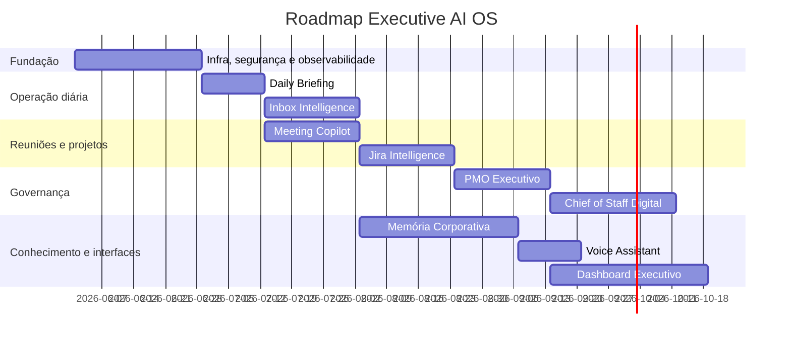

## 17. Modelo operacional

### 17.1 Rotina diária

1. 06:30: coleta de dados.
2. 06:45: briefing publicado.
3. A cada 2 horas: scan de riscos e recomendações.
4. Após reuniões: ata, decisões e ações.
5. Fim do dia: pendências e follow-ups.

### 17.2 Rotina semanal

- Relatório PMO semanal.
- Revisão de recomendações aceitas/rejeitadas.
- Ajuste de prompts e regras.
- Validação de custos e falhas.

### 17.3 Rotina mensal

- Teste de restore.
- Revisão de acessos e escopos.
- Revisão de retenção e compliance.
- Medição de ROI.

## 18. KPIs de sucesso

| KPI | Meta inicial |
| --- | --- |
| Tempo economizado por semana | 5 a 10 horas. |
| Reuniões com ata automática | Mais de 80% das reuniões relevantes. |
| Pendências críticas detectadas | Mais de 90% em amostra validada. |
| Recomendações aceitas | Mais de 40% após ajuste. |
| Tempo de busca por decisão | Menos de 2 minutos. |
| Falhas críticas de automação | Menos de 1 por semana. |

## 19. Backlog priorizado

1. Infraestrutura e segurança.
2. Daily Briefing.
3. Meeting Copilot.
4. RAG para atas e decisões.
5. Inbox Intelligence.
6. Jira Intelligence.
7. PMO Reports.
8. Chief of Staff Digital.
9. Voice Assistant.
10. Dashboard Executivo.

## 20. Conclusão

A solução proposta transforma ferramentas dispersas em um sistema operacional executivo com contexto, automação, memória e recomendação. O valor principal não está apenas em resumir informações, mas em converter sinais fragmentados em decisões rastreáveis, ações priorizadas e conhecimento reutilizável.
